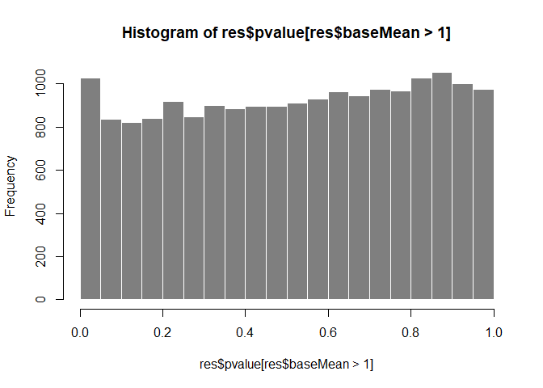

DeSeq2_Gacu_gut
================
Matthew Esqueda
2023-12-05

``` r
# Load data into DEseq2
countdata <- read.table("Gacu_gut_counts.tsv", sep = '\t', header = TRUE, row.names = 1)
coldata <- read.table("Gacu_gut_metadata.tsv", sep = '\t', header = TRUE, stringsAsFactors = TRUE)

ddsMat <- DESeqDataSetFromMatrix(countData = countdata,
                                 colData = coldata,
                                 design = ~ Population + Sex + Treatment)

dds <- DESeq(ddsMat)
```

    ## estimating size factors

    ## estimating dispersions

    ## gene-wise dispersion estimates

    ## mean-dispersion relationship

    ## final dispersion estimates

    ## fitting model and testing

``` r
dds
```

    ## class: DESeqDataSet 
    ## dim: 22456 32 
    ## metadata(1): version
    ## assays(4): counts mu H cooks
    ## rownames(22456): ENSGACG00000000002 ENSGACG00000000003 ...
    ##   ENSGACG00000022905 ENSGACG00000022906
    ## rowData names(30): baseMean baseVar ... deviance maxCooks
    ## colnames(32): X1A_02 X1A_03 ... X6C_01 X6C_04
    ## colData names(6): SampleID Population ... Flask sizeFactor

``` r
# Pre-filter the dataset
nrow(dds) # 22456
```

    ## [1] 22456

``` r
keep <- rowSums(counts(dds)) > 1
dds <- dds[keep,]
nrow(dds) # 20797
```

    ## [1] 20797

1,659 genes were removed during filtering

``` r
# rlog Transformation
rld <- rlog(dds, blind = TRUE)
```

    ## rlog() may take a few minutes with 30 or more samples,
    ## vst() is a much faster transformation

``` r
head(assay(rld), 3)
```

    ##                       X1A_02    X1A_03    X3A_01    X3A_02    X3C_01    X3C_04
    ## ENSGACG00000000002 -1.705795 -1.693710 -1.742694 -1.697224 -1.693234 -1.694764
    ## ENSGACG00000000003  3.129942  2.954529  3.292747  2.979586  3.355985  3.271290
    ## ENSGACG00000000004  2.607565  2.703630  2.671171  2.590007  2.938434  2.341362
    ##                       X3C_09    X3C_10    X4B_04    X4B_09    X4C_04    X4C_07
    ## ENSGACG00000000002 -1.699391 -1.754542 -1.749806 -1.693144 -1.751442 -1.692330
    ## ENSGACG00000000003  3.516315  3.267634  3.409569  3.412275  2.938466  2.803255
    ## ENSGACG00000000004  2.214552  2.798160  2.711602  2.810301  2.523175  2.677672
    ##                       X4D_01    X4D_08    X4F_04    X4F_08    X5A_01    X5A_04
    ## ENSGACG00000000002 -1.744386 -1.753850 -1.758437 -1.754348 -1.752232 -1.748849
    ## ENSGACG00000000003  3.033524  3.381681  3.092881  3.037758  4.041042  4.365491
    ## ENSGACG00000000004  2.641939  2.427793  2.411001  2.916549  1.844246  1.965048
    ##                       X5B_01    X5B_06    X5B_08    X5B_10    X5C_02    X5C_03
    ## ENSGACG00000000002 -1.742612 -1.751331 -1.741154 -1.745932 -1.741557 -1.744258
    ## ENSGACG00000000003  3.713932  4.035800  3.693473  4.294122  3.312061  4.283122
    ## ENSGACG00000000004  2.212982  2.036972  2.023100  1.879508  2.126248  1.999469
    ##                       X5C_05    X5C_07    X5D_01    X5D_11    X6A_02    X6A_05
    ## ENSGACG00000000002 -1.748983 -1.748923 -1.749928 -1.740730 -1.749240 -1.742151
    ## ENSGACG00000000003  3.667180  3.711297  3.729406  4.109099  3.308032  3.501193
    ## ENSGACG00000000004  1.862287  1.862625  1.957078  1.909287  1.860853  2.120712
    ##                       X6C_01    X6C_04
    ## ENSGACG00000000002 -1.746310 -1.748239
    ## ENSGACG00000000003  3.532210  3.592376
    ## ENSGACG00000000004  1.983996  1.866468

``` r
colData(rld)
```

    ## DataFrame with 32 rows and 6 columns
    ##        SampleID Population Treatment      Sex    Flask sizeFactor
    ##        <factor>   <factor>  <factor> <factor> <factor>  <numeric>
    ## X1A_02    1A_02         Bt        CV        M       1A   1.607047
    ## X1A_03    1A_03         Bt        CV        F       1A   1.047896
    ## X3A_01    3A_01         Bt        CV        F       3A   0.802558
    ## X3A_02    3A_02         Bt        CV        M       3A   1.186628
    ## X3C_01    3C_01         Bt        GF        M       3C   1.030393
    ## ...         ...        ...       ...      ...      ...        ...
    ## X5D_11    5D_11         RS        GF        M       5D   0.748697
    ## X6A_02    6A_02         RS        CV        F       6A   1.011739
    ## X6A_05    6A_05         RS        CV        M       6A   0.787279
    ## X6C_01    6C_01         RS        GF        M       6C   0.912113
    ## X6C_04    6C_04         RS        GF        F       6C   0.976533

``` r
dds <- estimateSizeFactors(dds)

df <- bind_rows(
  as_data_frame(assay(rld)[,1:3]) %>%
    mutate(transformation = "rlog")
)
```

    ## Warning: `as_data_frame()` was deprecated in tibble 2.0.0.
    ## ℹ Please use `as_tibble()` instead.
    ## ℹ The signature and semantics have changed, see `?as_tibble`.
    ## This warning is displayed once every 8 hours.
    ## Call `lifecycle::last_lifecycle_warnings()` to see where this warning was
    ## generated.

``` r
colnames(df)[1:3] <- c("x", "y", "z")

lvls <- c("rlog")
df$transformation <- factor(df$transformation, levels = lvls)

ggplot(df, aes(x=x, y=y)) + 
  geom_hex(bins=80) +
  coord_fixed() +
  facet_grid(. ~ transformation)
```

<!-- -->

We chose rlog because of the wide range of sequencing depth in the
dataset.

``` r
# Generate sample distance heatmaps with dendrograms

# Euclidean distance
sampleDists <- dist(t(assay(rld)))

sampleDistMatrix <- as.matrix(sampleDists)
rownames(sampleDistMatrix) <- paste(rld$Population, rld$Sex, rld$Treatment, sep = '-')
colnames(sampleDistMatrix) <- NULL
colors <- colorRampPalette(rev(brewer.pal(9, "Blues")))(255)
pheatmap(sampleDistMatrix,
         cllustering_distance_rows = sampleDists,
         col = colors)
```

<!-- -->

``` r
# Poisson Distance
poisd <- PoissonDistance(t(counts(dds)))

samplePoisDistMatrix <- as.matrix(poisd$dd)
rownames(samplePoisDistMatrix) <- paste(dds$Population, dds$Sex, dds$Treatment, sep = '-')
colnames(samplePoisDistMatrix) <- NULL
pheatmap(samplePoisDistMatrix,
         clustering_distance_rows = poisd$dd,
         clustering_distance_cols = poisd$dd,
         col = colors)
```

<!-- -->

The Euclidean distance heatmap assesses the overall similarity between
samples. The Poisson distance is also a measure of dissimilarity between
counts that also considers the inherent variance in the dataset. RS -
F - CV is a potential outlier in both plots.

``` r
# PCA plot
plotPCA(rld, intgroup = c("Population", "Sex", "Treatment"))
```

<!-- -->

``` r
# PCA plot using generalized PCA
gpca <- glmpca(counts(dds), L=2)
gpca.dat <- gpca$factors
gpca.dat$pop <- dds$Population
gpca.dat$treatment <- dds$Treatment
gpca.dat$sex <- dds$Sex
gpca.dat$all <- paste(dds$Sex, dds$Treatment, dds$Population)

ggplot(gpca.dat, aes(x=dim1, y=dim2, color=all)) +
  geom_point(size=3) +
  coord_fixed() +
  ggtitle("glmcpa - Generalized PCA")
```

<!-- -->

``` r
# MDS plot
mds <- as.data.frame(colData(rld)) %>%
        cbind(cmdscale(sampleDistMatrix))

ggplot(mds, aes(x= `1`, y= `2`, color = Population:Sex:Treatment)) +
 geom_point(size=3) + coord_fixed() + ggtitle("MDS with rld data")
```

<!-- -->

``` r
# Results table
res <- results(dds)
res
```

    ## log2 fold change (MLE): Treatment GF vs CV 
    ## Wald test p-value: Treatment GF vs CV 
    ## DataFrame with 20797 rows and 6 columns
    ##                     baseMean log2FoldChange     lfcSE        stat    pvalue
    ##                    <numeric>      <numeric> <numeric>   <numeric> <numeric>
    ## ENSGACG00000000002   0.22079    -0.32872792  1.287912 -0.25524096  0.798537
    ## ENSGACG00000000003  12.96398     0.03290740  0.259541  0.12679098  0.899106
    ## ENSGACG00000000004   5.63929    -0.24101869  0.307324 -0.78424971  0.432894
    ## ENSGACG00000000005   1.98798     0.00131012  0.442476  0.00296088  0.997638
    ## ENSGACG00000000006  59.44245     0.08862568  0.113686  0.77956820  0.435645
    ## ...                      ...            ...       ...         ...       ...
    ## ENSGACG00000022899  1.545936     -0.6340292  0.537600  -1.1793708 0.2382505
    ## ENSGACG00000022901  2.596269      0.0176752  0.419858   0.0420981 0.9664205
    ## ENSGACG00000022902  0.162294     -0.7404390  2.980030  -0.2484670 0.8037731
    ## ENSGACG00000022904  0.257828     -1.1587935  1.896767  -0.6109308 0.5412454
    ## ENSGACG00000022906  1.149883     -2.1818479  1.299790  -1.6786151 0.0932271
    ##                         padj
    ##                    <numeric>
    ## ENSGACG00000000002        NA
    ## ENSGACG00000000003   0.99984
    ## ENSGACG00000000004   0.99984
    ## ENSGACG00000000005   0.99984
    ## ENSGACG00000000006   0.99984
    ## ...                      ...
    ## ENSGACG00000022899   0.99984
    ## ENSGACG00000022901   0.99984
    ## ENSGACG00000022902        NA
    ## ENSGACG00000022904        NA
    ## ENSGACG00000022906   0.99984

``` r
mcols(res, use.names = TRUE)
```

    ## DataFrame with 6 rows and 2 columns
    ##                        type            description
    ##                 <character>            <character>
    ## baseMean       intermediate mean of normalized c..
    ## log2FoldChange      results log2 fold change (ML..
    ## lfcSE               results standard error: Trea..
    ## stat                results Wald statistic: Trea..
    ## pvalue              results Wald test p-value: T..
    ## padj                results   BH adjusted p-values

``` r
summary(res)
```

    ## 
    ## out of 20797 with nonzero total read count
    ## adjusted p-value < 0.1
    ## LFC > 0 (up)       : 7, 0.034%
    ## LFC < 0 (down)     : 67, 0.32%
    ## outliers [1]       : 128, 0.62%
    ## low counts [2]     : 1610, 7.7%
    ## (mean count < 1)
    ## [1] see 'cooksCutoff' argument of ?results
    ## [2] see 'independentFiltering' argument of ?results

``` r
res.01 <- results(dds, alpha = 0.01)
table(res.01$padj < 0.05)
```

    ## 
    ## FALSE  TRUE 
    ## 20646    23

``` r
res.s <- results(dds, alpha = 0.05)
table(res.s$padj < 0.1)
```

    ## 
    ## FALSE  TRUE 
    ## 17786    75

``` r
sum(res$pvalue < 0.1, na.rm = TRUE)
```

    ## [1] 1892

``` r
# Count plot
topGene <- rownames(res)[which.min(res$padj)]
plotCounts(dds, gene = topGene, intgroup = c("Treatment"))
```

<!-- -->

``` r
geneCounts <-plotCounts(dds, gene = topGene, intgroup = c("Sex", "Treatment"),
                        returnData = TRUE)
ggplot(geneCounts, aes(x=Sex, y=count, color=Treatment)) +
  scale_y_log10() +
  geom_beeswarm(cex=3)
```

<!-- -->

``` r
ggplot(geneCounts, aes(x=Sex, y=count, color=Treatment, group=Treatment)) +
  scale_y_log10() + 
  geom_point(size=3) +
  geom_line()
```

<!-- -->

``` r
# MA-plot
resultsNames(dds)
```

    ## [1] "Intercept"           "Population_RS_vs_Bt" "Sex_M_vs_F"         
    ## [4] "Treatment_GF_vs_CV"

``` r
res <- lfcShrink(dds, coef = "Treatment_GF_vs_CV", type = "apeglm")
```

    ## using 'apeglm' for LFC shrinkage. If used in published research, please cite:
    ##     Zhu, A., Ibrahim, J.G., Love, M.I. (2018) Heavy-tailed prior distributions for
    ##     sequence count data: removing the noise and preserving large differences.
    ##     Bioinformatics. https://doi.org/10.1093/bioinformatics/bty895

``` r
plotMA(res, ylim=c(-5,5))
```

<!-- -->

``` r
res.noshr <- results(dds, name="Treatment_GF_vs_CV")
plotMA(res.noshr, ylim=c(-5,5))
```

<!-- -->

``` r
plotMA(res, ylim = c(-5,5))
topGene <- rownames(res)[which.min(res$padj)]
with(res[topGene, ], {
  points(baseMean, log2FoldChange, col="dodgerblue", cex=2, lwd=2)
  text(baseMean, log2FoldChange, topGene, pos=2, col="dodgerblue")
})
```

<!-- -->

``` r
hist(res$pvalue[res$baseMean > 1], breaks = 0:20/20,
     col = "grey50", border = "white")
```

<!-- -->

``` r
# Gene clustering
topvarGenes <- head(order(rowVars(assay(rld)), decreasing = TRUE), 20)

mat <- assay(rld)[topvarGenes,]
mat <- mat - rowMeans(mat)
anno <- as.data.frame(colData(rld)[, c("Treatment", "Sex")])
pheatmap(mat, annotation_col = anno)
```

<!-- -->
